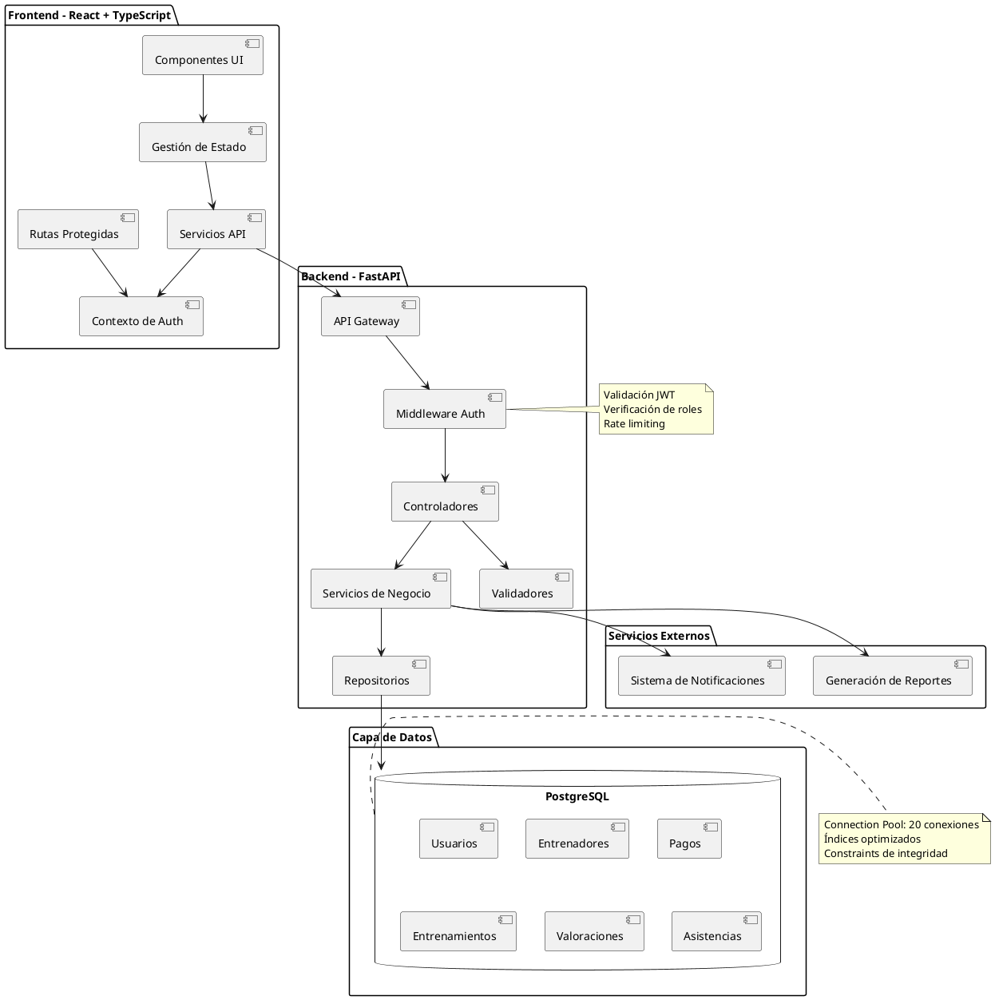
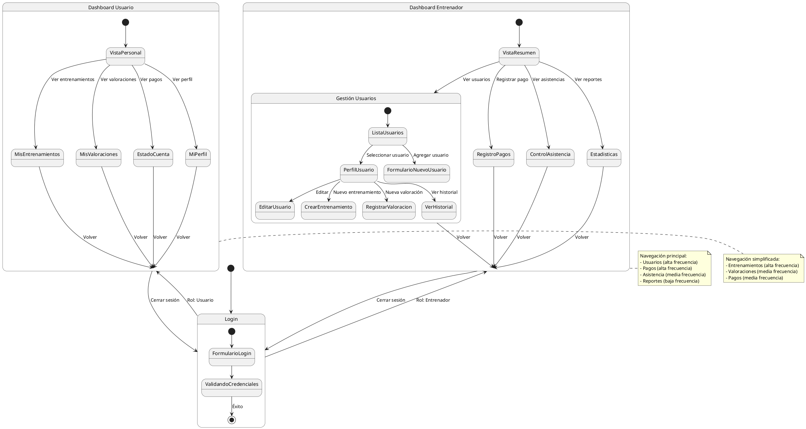
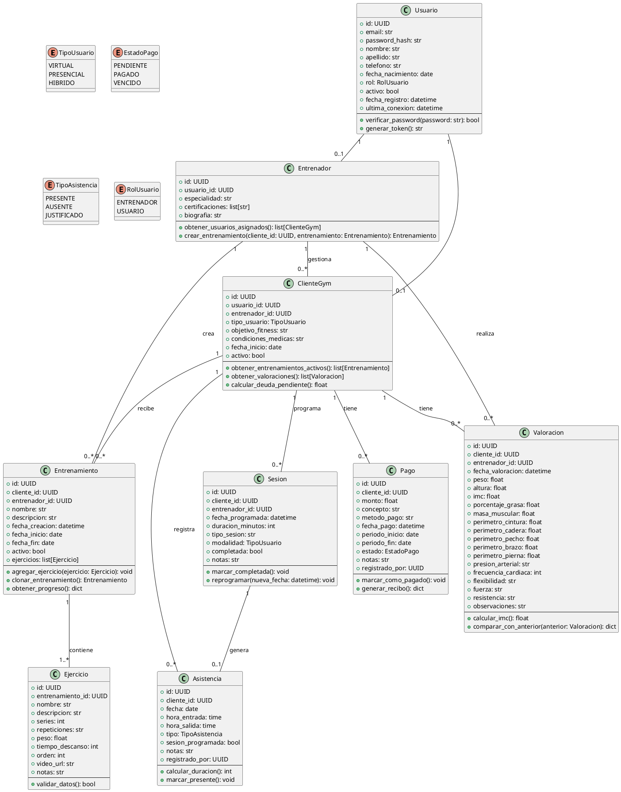
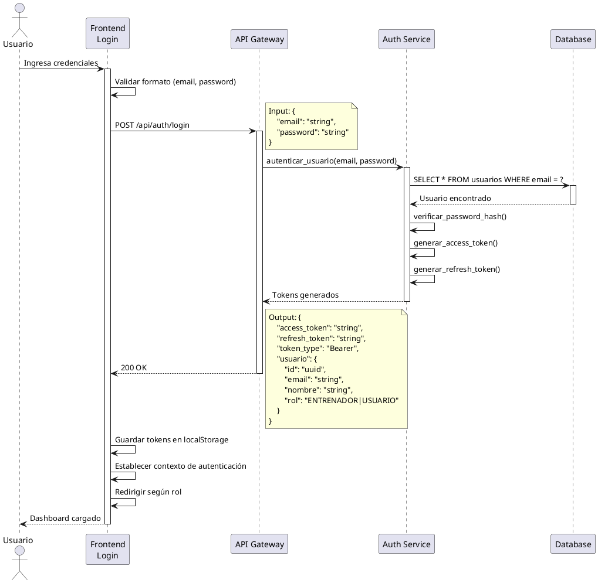
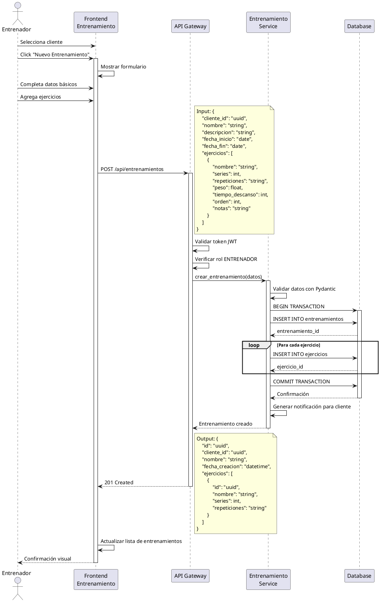
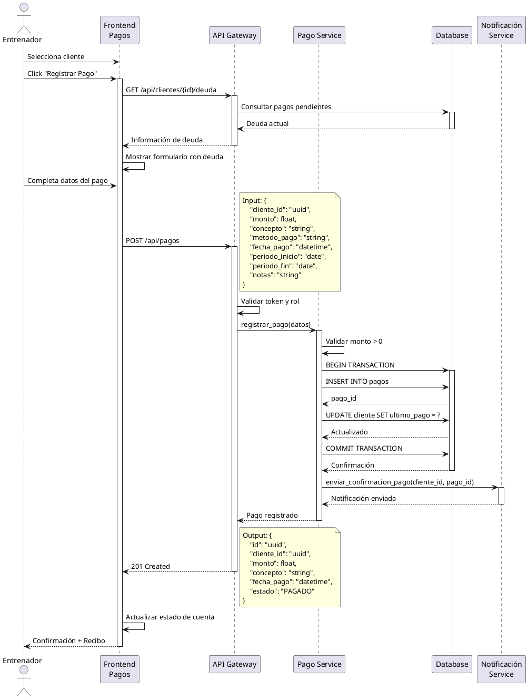
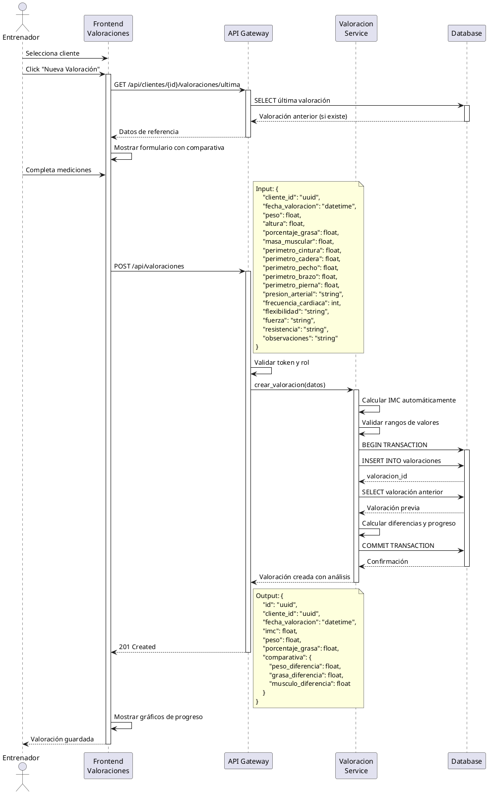
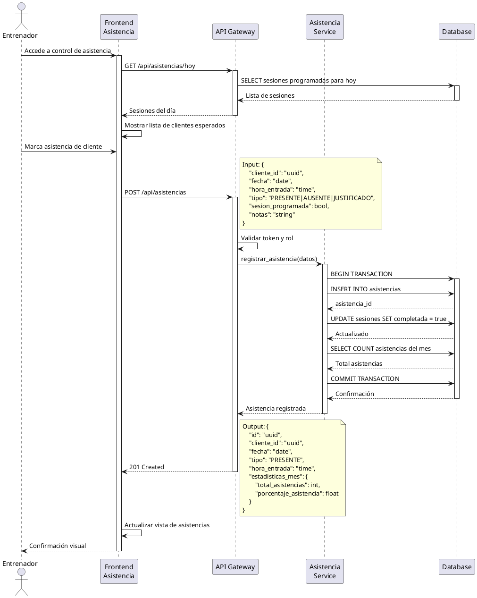
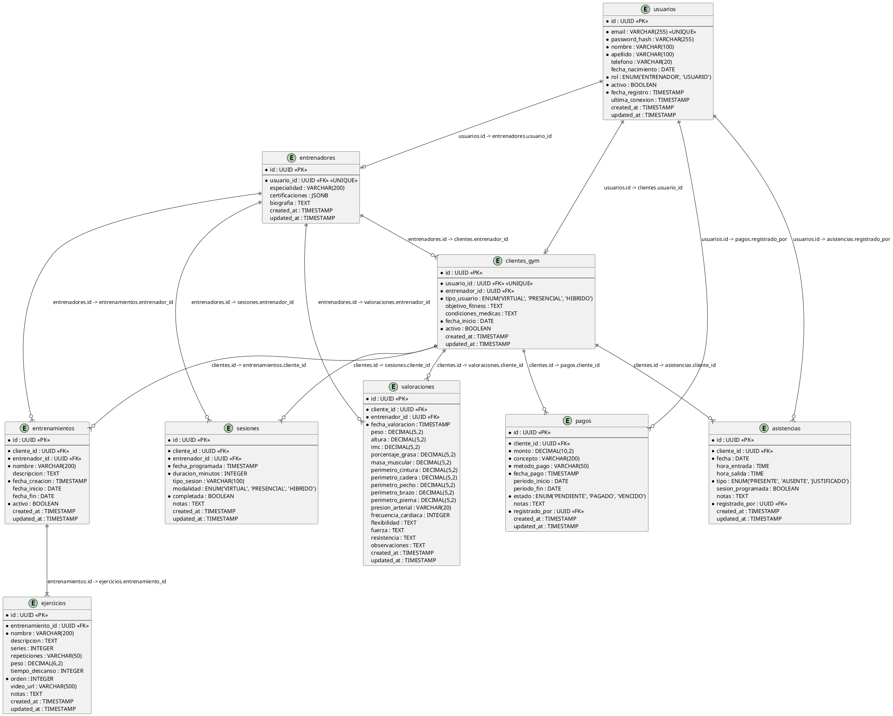

# Diseño del Sistema - Aplicación de Gestión de Gimnasio

## 1. Enfoque de Implementación

Implementaremos una aplicación web moderna con las siguientes características técnicas:

### Desafíos Técnicos y Soluciones

1. **Gestión de Entrenamientos Personalizados**:
   - Solución: Sistema de plantillas reutilizables con capacidad de personalización completa
2. **Control de Asistencia en Tiempo Real**:

   - Solución: Endpoints optimizados con actualizaciones incrementales y cache estratégico

3. **Reportes y Estadísticas**:
   - Solución: Queries optimizadas con agregaciones en base de datos y cache de resultados

## 2. Patrones de Interacción Usuario-UI

### Flujo Principal - Entrenador

1. **Login y Dashboard**

   - Entrenador ingresa credenciales → Validación → Redirección a dashboard
   - Dashboard muestra: resumen de pagos pendientes, clases del día, alertas importantes

2. **Gestión de Usuarios**

   - Entrenador accede a lista de usuarios → Puede filtrar por tipo (virtual/presencial/híbrido)
   - Click en usuario → Ver perfil completo con historial de pagos, asistencias, valoraciones
   - Botón "Agregar Usuario" → Formulario modal → Guardar y refrescar lista

3. **Registro de Pagos**

   - Entrenador selecciona usuario → Click "Registrar Pago"
   - Formulario: monto, concepto (mensualidad/sesión), método de pago, fecha
   - Confirmación → Actualización automática del estado de cuenta

4. **Creación de Entrenamientos**

   - Entrenador selecciona usuario → Sección "Entrenamientos"
   - Click "Nuevo Entrenamiento" → Editor con bloques de ejercicios
   - Agregar ejercicios: nombre, series, repeticiones, peso, notas
   - Guardar → Notificación al usuario

5. **Registro de Valoraciones**

   - Entrenador selecciona usuario → "Nueva Valoración"
   - Formulario extenso: medidas corporales, composición, pruebas físicas
   - Guardar → Histórico de valoraciones con gráficos de progreso

6. **Control de Asistencia**
   - Vista de calendario/lista de sesiones programadas
   - Marcar asistencia: presente/ausente/justificado
   - Filtros por fecha, usuario, tipo de sesión

### Flujo Principal - Usuario

1. **Login y Panel Personal**

   - Usuario ingresa → Dashboard con información personalizada
   - Vista de: próximas sesiones, plan de entrenamiento actual, estado de pagos

2. **Ver Entrenamientos**

   - Acceso a plan de entrenamiento asignado
   - Visualización clara de ejercicios con instrucciones
   - Marcar ejercicios como completados (opcional)

3. **Historial de Valoraciones**

   - Lista de valoraciones realizadas
   - Gráficos de evolución de métricas clave
   - Comparación entre valoraciones

4. **Estado de Cuenta**
   - Visualización de pagos realizados
   - Pagos pendientes con fechas de vencimiento
   - Historial completo de transacciones

## 3. Arquitectura del Sistema



## 4. Flujo de Navegación UI



## 5. Diagrama de Clases y Estructuras de Datos



## 6. Diagrama de Secuencia - Flujos Principales

### 6.1 Flujo de Autenticación



### 6.2 Flujo de Creación de Entrenamiento Personalizado



### 6.3 Flujo de Registro de Pago



### 6.4 Flujo de Registro de Valoración Física



### 6.5 Flujo de Control de Asistencia



## 7. Diagrama de Entidad-Relación (Base de Datos)



### Índices de Base de Datos para Optimización

```sql
-- Índices para mejorar rendimiento de consultas frecuentes
CREATE INDEX idx_clientes_entrenador ON clientes_gym(entrenador_id) WHERE activo = true;
CREATE INDEX idx_clientes_tipo ON clientes_gym(tipo_usuario);
CREATE INDEX idx_pagos_cliente_fecha ON pagos(cliente_id, fecha_pago DESC);
CREATE INDEX idx_pagos_estado ON pagos(estado) WHERE estado != 'PAGADO';
CREATE INDEX idx_entrenamientos_cliente_activo ON entrenamientos(cliente_id) WHERE activo = true;
CREATE INDEX idx_valoraciones_cliente_fecha ON valoraciones(cliente_id, fecha_valoracion DESC);
CREATE INDEX idx_asistencias_cliente_fecha ON asistencias(cliente_id, fecha DESC);
CREATE INDEX idx_asistencias_fecha ON asistencias(fecha) WHERE tipo = 'PRESENTE';
CREATE INDEX idx_sesiones_fecha ON sesiones(fecha_programada) WHERE completada = false;
CREATE INDEX idx_usuarios_email ON usuarios(email);
```

## 8. Consideraciones de Escalabilidad y Rendimiento

### Para 10 Entrenadores Concurrentes

1. **Connection Pooling**

   - Pool mínimo: 5 conexiones
   - Pool máximo: 20 conexiones
   - Timeout: 30 segundos

2. **Caché de Datos**

   - Implementar Redis para cache de sesiones JWT
   - Cache de queries frecuentes (dashboard, listas de usuarios)
   - TTL: 5 minutos para datos dinámicos, 1 hora para datos estáticos

3. **Optimización de Queries**

   - Uso de índices compuestos para filtros comunes
   - Paginación en todas las listas (20 items por página)
   - Lazy loading de relaciones en ORM

4. **Rate Limiting**

   - 100 requests por minuto por usuario autenticado
   - 10 requests por minuto para endpoints de login

5. **Compresión de Respuestas**

   - Gzip para respuestas > 1KB
   - Reducción de payload en APIs (solo campos necesarios)

6. **Monitoreo**
   - Logging de errores y excepciones
   - Métricas de rendimiento de endpoints
   - Alertas para queries lentas (> 1 segundo)

## 9. Seguridad

### Medidas Implementadas

1. **Autenticación y Autorización**

   - JWT con expiración de 1 hora para access token
   - Refresh token con expiración de 7 días
   - Validación de roles en cada endpoint protegido
   - Hashing de contraseñas con bcrypt (cost factor: 12)

2. **Protección de Datos**

   - HTTPS obligatorio en producción
   - Sanitización de inputs (prevención de SQL injection)
   - Validación de datos con Pydantic/Zod
   - CORS configurado para dominios específicos

3. **Protección contra Ataques**

   - Rate limiting por IP y usuario
   - Protección CSRF en formularios
   - Headers de seguridad (X-Frame-Options, X-Content-Type-Options)
   - Validación de tamaño de archivos (si se implementa upload)

4. **Auditoría**
   - Logging de acciones críticas (creación, edición, eliminación)
   - Timestamps de creación y actualización en todas las tablas
   - Registro de quién realizó cada acción (registrado_por)

## 10. Aspectos No Claros o Supuestos

### Supuestos Realizados

1. **Gestión de Pagos**

   - Se asume que los pagos son solo registro y seguimiento, sin integración con pasarelas de pago reales
   - Los entrenadores registran manualmente los pagos recibidos
   - No se requiere generación automática de facturas fiscales

2. **Notificaciones**

   - Se asume notificaciones por email básicas
   - No se implementa sistema de notificaciones push en esta versión

3. **Entrenamientos Personalizados**

   - Los ejercicios se describen en texto, sin biblioteca predefinida
   - No se incluye sistema de videos integrado (solo URLs externas)
   - No hay tracking automático de progreso del usuario

4. **Valoraciones Físicas**

   - Las mediciones son ingresadas manualmente por el entrenador
   - No hay integración con dispositivos de medición (básculas inteligentes, etc.)

5. **Control de Asistencia**

   - El registro de asistencia es manual por parte del entrenador
   - No se implementa sistema de check-in automático con QR o biométrico

6. **Multiidioma**
   - La aplicación se desarrollará inicialmente solo en español
   - La internacionalización puede agregarse en versiones futuras

### Preguntas para Clarificación Futura

1. ¿Se requiere integración con sistemas de pago en línea en el futuro?
2. ¿Es necesario un sistema de reportes exportables (PDF, Excel)?
3. ¿Se necesita un módulo de comunicación interna (chat) entre entrenador y usuario?
4. ¿Hay requisitos específicos de cumplimiento normativo (protección de datos de salud)?
5. ¿Se planea expansión a más de 10 entrenadores en el corto plazo?

---

**Fecha de Creación**: 2025-11-23  
**Versión**: 1.0  
**Autor**: Bob (Arquitecto de Software)
